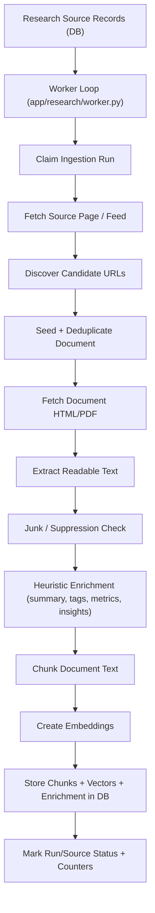
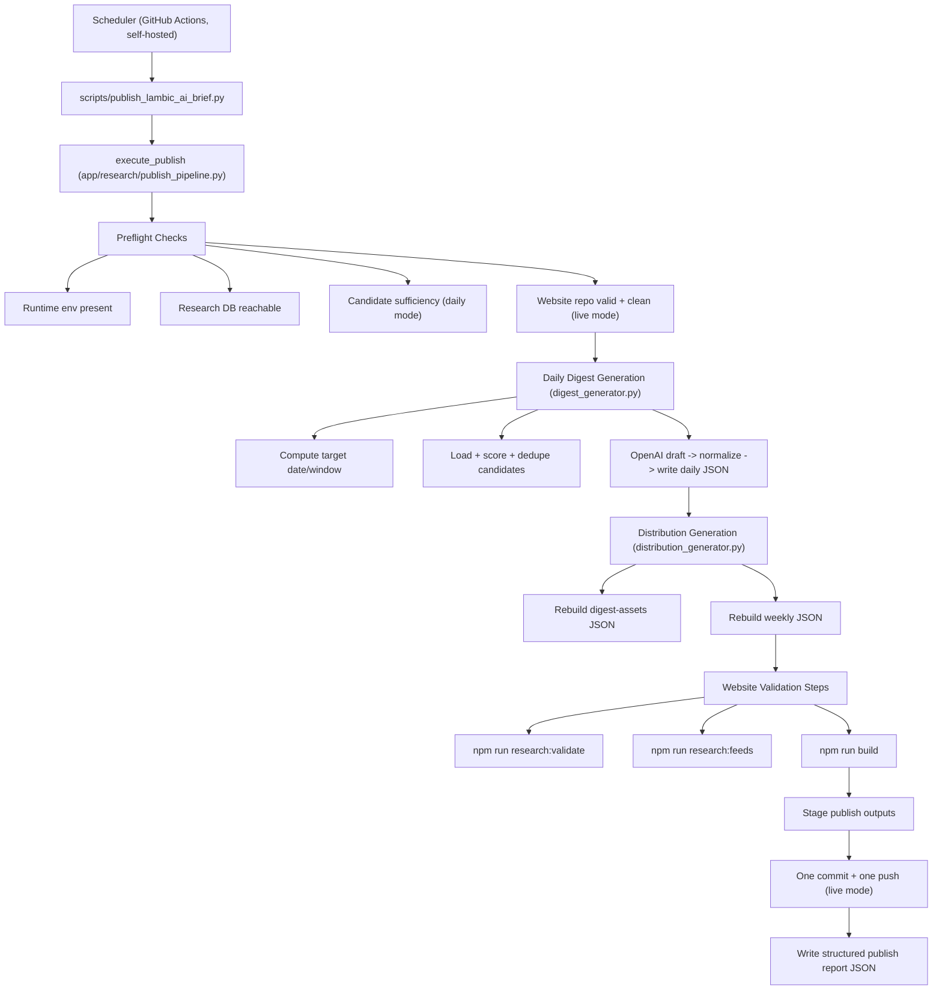
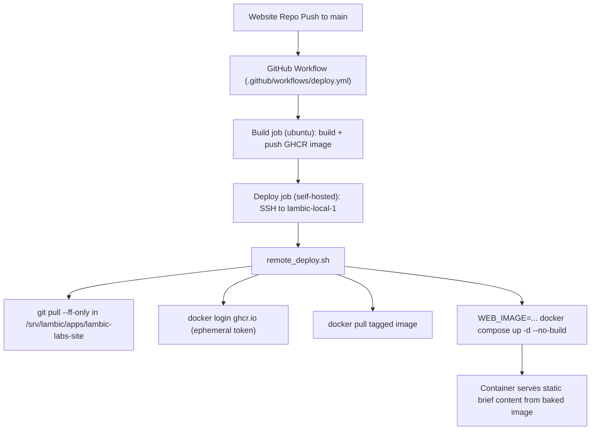
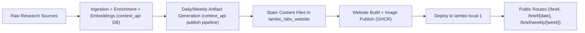

# Lambic AI Brief Pipeline Diagrams

This document gives a visual model of the production pipeline from research ingestion to website deployment.

## 1) Research Ingestion, Enrichment, and Indexing

## 2) Daily Brief Publish Orchestration

## 3) Website Build and Deployment

## 4) End-to-End Data to Site Path

## Operational Notes

- Daily brief generation and weekly/asset regeneration are now part of one canonical publish command.
- Dry-run mode performs the same generation and validation sequence in a temp workspace copy and does not push.
- The website deploy path is image-based (`docker compose up -d --no-build`) and uses the GHCR image built by CI.
- The website reads brief artifacts from `apps/web/content/research-digests` and `apps/web/content/research-weekly` at build/runtime loader boundaries.
